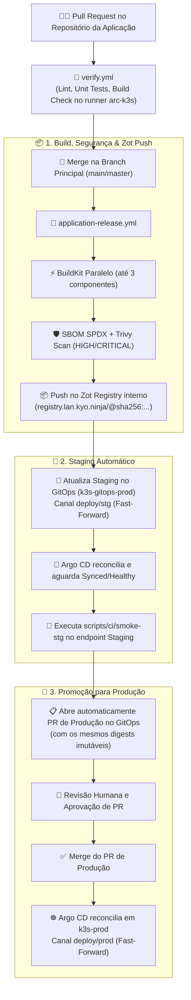

# 🚀 platform-workflows

> **Centralized Reusable CI/CD Workflows & Progressive Delivery Engine for KyoNinja Platform**

[](https://github.com/JustShinobi/platform-workflows/actions/workflows/self-test.yml)
[](contracts/application.schema.json)
[](https://registry.lan.kyo.ninja)
[](https://argocd.lan.kyo.ninja)

O **`platform-workflows`** é o motor centralizado de CI/CD e governança de entrega contínua da organização **JustShinobi / KyoNinja**. Ele implementa o padrão **Zero-Touch Progressive Delivery**: cada microserviço é construído uma única vez em runners internos, escaneado contra vulnerabilidades, publicado com digest imutável no **Zot Registry**, promovido automaticamente para **Staging**, validado via **Smoke Tests** e submetido para aprovação em **Produção** via Pull Request no repositório GitOps ([`k3s-gitops-prod`](https://github.com/JustShinobi/k3s-gitops-prod)).

---

## 🏛️ Fluxo de Entrega Progressiva (Delivery Flow)



---

## 📦 Catálogo de Reusable Workflows

| Workflow | Ponto de Entrada / Tipo | Descrição e Finalidade |
| :--- | :--- | :--- |
| [`application-release.yml`](.github/workflows/application-release.yml) | `workflow_call` (Push) | **Motor Principal:** Build paralelo multi-componente, SBOM, Trivy, Zot push por digest imutável, promoção para Staging, validação de health no Argo CD, smoke tests e abertura automática de PR de Produção. |
| [`verify.yml`](.github/workflows/verify.yml) | `workflow_call` (PR) | **Verificação de PRs:** Execução hermética e isolada do contrato `scripts/ci/verify` em runners efêmeros ARC (`arc-k3s`). |
| [`rollback.yml`](.github/workflows/rollback.yml) | `workflow_dispatch` | **Rollback Seguro:** Rollback controlado de versão no GitOps para Staging ou Produção com auditoria completa e lock de concorrência. |
| [`sync-secrets-infisical.yml`](.github/workflows/sync-secrets-infisical.yml) | `workflow_dispatch` / `call` | **Sincronização de Segredos:** Sincronização automatizada de variáveis e segredos a partir do Infisical (`infisical.lan.kyo.ninja`). |
| [`helm-lint-and-validate.yml`](.github/workflows/helm-lint-and-validate.yml) | `workflow_call` | Validação de sintaxe, template rendering e resolução de dependências OCI de Helm Charts. |
| [`build-and-push-container.yml`](.github/workflows/build-and-push-container.yml) | `workflow_call` | Build e publicação direta de contêiner único no Zot Registry (compatibilidade legada). |
| [`build-and-push-chart.yml`](.github/workflows/build-and-push-chart.yml) | `workflow_call` | Empacotamento e publicação direta de Helm Chart OCI no Zot Registry (`oci://registry.lan.kyo.ninja/charts`). |
| [`avoid-empty-prs.yml`](.github/workflows/avoid-empty-prs.yml) | `workflow_call` | Guardrail de CI que detecta e fecha automaticamente Pull Requests vazios ou sem alterações. |
| [`commit-lint.yml`](.github/workflows/commit-lint.yml) | `workflow_call` | Validação estrita de títulos de PR seguindo a convenção *Conventional Commits*. |
| [`self-test.yml`](.github/workflows/self-test.yml) | `push` / `pull_request` | Suíte de testes unitários e validação dos JSON Schemas do próprio repositório `platform-workflows`. |

---

## 🛠️ Guia de Onboarding de Novos Microserviços

Para integrar uma nova aplicação à plataforma de CI/CD, crie os 4 arquivos de contrato no repositório da aplicação:

### 1. Descriptor Declarativo: `.ci/application.yaml`
```yaml
schemaVersion: 1
gitops:
  owner: JustShinobi
  repository: k3s-gitops-prod
  baseBranch: main
  stagingBranch: deploy/stg
  productionBranch: deploy/prod
  imagePromotion: chart-values # ou kustomize-patch
  stagingPath: clusters/prod/workloads/minha-app
  productionPath: clusters/prod/workloads/minha-app

components:
  - name: api
    image: minha-app/api
    context: .
    dockerfile: apps/api/Dockerfile
    workload: minha-app-api
    container: api
    rolloutProfile: canary
```

> **Validação do Schema:** O contrato formal do descriptor é validado pelo JSON Schema em [`contracts/application.schema.json`](contracts/application.schema.json).

### 2. Caller de Release: `.github/workflows/application-ci.yml`
```yaml
name: CI/CD Pipeline

on:
  pull_request:
    branches: [main, master]
  push:
    branches: [main, master]

jobs:
  verify:
    if: github.event_name == 'pull_request'
    uses: JustShinobi/platform-workflows/.github/workflows/verify.yml@<COMMIT_SHA_40_CHARS>
    with:
      executor: arc

  release:
    if: github.event_name == 'push'
    uses: JustShinobi/platform-workflows/.github/workflows/application-release.yml@<COMMIT_SHA_40_CHARS>
    with:
      executor: arc
    secrets:
      PLATFORM_GITOPS_TOKEN: ${{ secrets.PLATFORM_GITOPS_TOKEN }}
      ARGOCD_SERVER: ${{ secrets.ARGOCD_SERVER }}
      ARGOCD_AUTH_TOKEN: ${{ secrets.ARGOCD_AUTH_TOKEN }}
```

### 3. Caller de Rollback: `.github/workflows/rollback.yml`
```yaml
name: Rollback

on:
  workflow_dispatch:
    inputs:
      target_env:
        description: 'Ambiente de Rollback (staging ou production)'
        required: true
        type: choice
        options: [staging, production]
      gitops_commit:
        description: 'SHA de 40 caracteres do commit anterior no k3s-gitops-prod'
        required: true
        type: string

jobs:
  rollback:
    uses: JustShinobi/platform-workflows/.github/workflows/rollback.yml@<COMMIT_SHA_40_CHARS>
    with:
      target_env: ${{ inputs.target_env }}
      gitops_commit: ${{ inputs.gitops_commit }}
    secrets:
      PLATFORM_GITOPS_TOKEN: ${{ secrets.PLATFORM_GITOPS_TOKEN }}
```

### 4. Scripts de Contrato Executáveis (`scripts/ci/`)
- **`scripts/ci/verify`**: Executa lint, testes unitários e checagens de build (sem parâmetros).
- **`scripts/ci/smoke-stg`**: Recebe `STAGING_BASE_URL` como variável de ambiente e valida a saúde do endpoint após o deploy em Staging.

---

## 🎯 Modos de Promoção de Imagem GitOps

O `platform-workflows` suporta dois modos de promoção declarados no campo `gitops.imagePromotion`:

1. **`chart-values` (Recomendado / Canônico):**
   - Utilizado por aplicações empacotadas via Wrapper Chart do [`charts/homelab-k8s-app-chart`](https://github.com/JustShinobi/infra-cluster/tree/main/charts/homelab-k8s-app-chart).
   - O pipeline localiza a dependência com `alias` correspondente ao componente e atualiza `image.digest` diretamente no `values-prd.yaml` / `values-stg.yaml`.
2. **`kustomize-patch`:**
   - Utilizado por aplicações com overlays tradicionais do Kustomize.
   - O pipeline aplica uma atualização de patch no arquivo `images.yaml` declarado em `stagingPath` e `productionPath`.

---

## 🔒 Segurança e Governança de Segredos

1. **Credenciais do Zot Registry**:
   - Os runners ARC montam o volume `/run/secrets/zot/config.json` de forma read-only a partir do cluster K3s.
   - O release workflow copia o arquivo com permissão restrita `0600` para a variável de ambiente `DOCKER_CONFIG` do job.
   - **Nenhum usuário ou segredo do Zot precisa ser cadastrado no repositório da aplicação.**
2. **`PLATFORM_GITOPS_TOKEN`**:
   - Fine-Grained Personal Access Token (PAT) com permissões restritas de escrita no repositório `k3s-gitops-prod` para atualizar branches de staging e abrir Pull Requests de produção.
3. **GitHub Environments & Approval Gates**:
   - `staging`: Execução automática e não bloqueante.
   - `production-promotion`: Gate natural via Pull Request revisado por humanos.
   - `production-rollback`: Requer aprovação de mantenedores.

---

## 🧪 Validação Local e Testes Unitários

```bash
# Instalar dependências de desenvolvimento
python3 -m pip install --requirement requirements-dev.txt

# Validar sintaxe e conformidade de um descriptor .ci/application.yaml
python3 scripts/validate_descriptor.py .ci/application.yaml

# Executar a suíte de testes unitários do platform-workflows
python3 -m unittest discover -s tests -v

# Renderizar a matriz de release para inspeção local
python3 scripts/validate_descriptor.py examples/application.yaml --no-check-files --print-matrix
```
